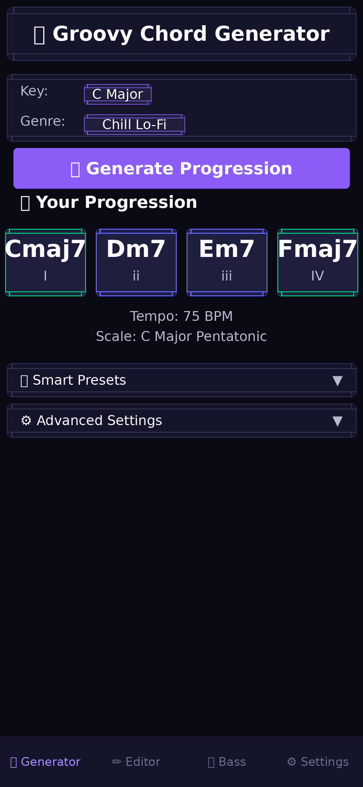
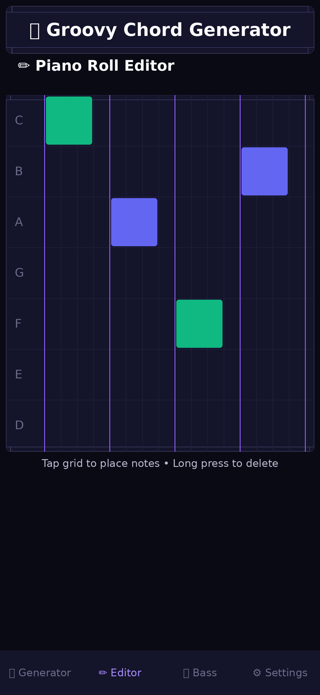
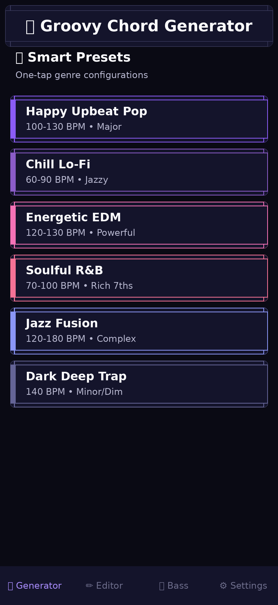
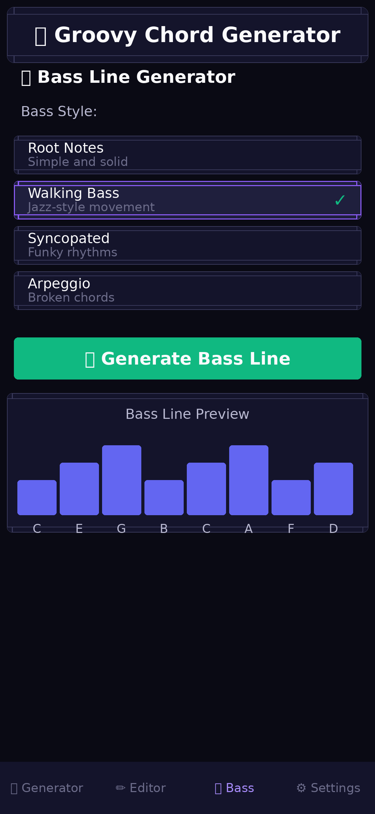

# 🎵 Groovy Chord Generator

<div align="center">


**Create amazing chord progressions for any genre** — A mobile-optimized music creation tool built with Flutter.

</div>

## 📸 Preview

<div align="center">

### Main Chord Generator


### Piano Roll Editor
 

### Bass Line Generator


</div>

## 🎬 Quick Demo

The Groovy Chord Generator helps you create professional chord progressions instantly:

1. **Select your key and genre** - Choose from 12+ musical genres
2. **Generate progression** - Get music-theory-based chord progressions with one tap
3. **Customize and refine** - Use smart presets, lock specific chords, or add variations
4. **Edit in piano roll** - Fine-tune your progression with the built-in editor
5. **Generate bass lines** - Add complementary bass lines with multiple styles
6. **Save and share** - Keep your favorites and share via URL

### Why Groovy Chord Generator?

✨ **Smart & Intuitive** - Genre-specific presets with optimized settings  
🎓 **Music Theory Powered** - Based on analysis of top songs in each genre  
🎨 **Beautiful Dark Theme** - Modern UI with smooth animations  
🔒 **Chord Locking** - Lock specific chords while regenerating others  
❤️ **Favorites System** - Save and manage your best progressions  
🔗 **Easy Sharing** - Share your chord progressions via URL

## ✨ Features

- 🎹 **Generate chord progressions** for 12+ genres (Pop, Lo-Fi, EDM, R&B, Jazz, Trap, and more)
- 🎯 **Smart Presets** — One-tap genre configurations with optimized settings
- 🎸 **Bass Line Generator** — Multiple bass styles including walking bass, syncopated, and more
- 🎵 **Advanced Music Theory** — Voice leading, modal interchange, secondary dominants
- 🌶️ **Spice It Up!** — Add variations and extensions to your progressions
- 📊 **Functional Harmony** — Generate progressions based on harmonic functions
- 🎛️ **Groove Engine** — Apply rhythmic templates like Neo-Soul Swing, Funk Syncopation
- 📜 **History** — Access your previous progressions
- 🔒 **Chord Locking** — Lock specific chords while regenerating others
- ❤️ **Favorites List** — Save and manage your favorite chord progressions
- 🔗 **Share Chord Set** — Generate and share URLs for your chord selections

## 🚀 Getting Started

### Prerequisites

- Flutter SDK 3.0 or higher
- Android Studio / VS Code with Flutter extensions
- Android SDK

### Installation

1. Clone the repository:
   ```bash
   git clone https://github.com/valleedgar085-rgb/groovy-chord-generator.git
   cd groovy-chord-generator
   ```

2. Install dependencies:
   ```bash
   flutter pub get
   ```

3. Run the app:
   ```bash
   flutter run
   ```

### Build APK

```bash
flutter build apk --release
```

### Build for Web

```bash
flutter build web --release
```

## 📱 App Structure

```
lib/
├── main.dart              # App entry point
├── models/
│   ├── types.dart         # Type definitions
│   └── constants.dart     # Music theory constants
├── providers/
│   └── app_state.dart     # State management
├── screens/
│   ├── home_screen.dart   # Main screen
│   ├── generator_tab.dart # Chord generator
│   ├── editor_tab.dart    # Piano roll editor
│   ├── bass_tab.dart      # Bass line generator
│   └── settings_tab.dart  # Settings
├── widgets/
│   ├── header.dart        # App header
│   ├── bottom_navigation.dart
│   ├── fab_menu.dart      # Floating action button
│   ├── chord_card.dart    # Chord display card
│   ├── preset_card.dart   # Preset selection card
│   ├── control_dropdown.dart
│   └── collapsible_section.dart
├── services/
│   ├── favorites_service.dart  # Favorites management
│   └── share_service.dart      # URL sharing functionality
├── utilities/
│   ├── helpers.dart       # Utility helper functions
│   └── validators.dart    # Input validation
└── utils/
    ├── theme.dart         # App theming
    └── music_theory.dart  # Music theory functions
```

## 🌐 Web Version Structure

```
web/
├── index.html             # Web entry point
├── assets/
│   ├── images/            # Web images and icons
│   └── styles/
│       └── main.css       # Web-specific styles
```

## 🎨 Theme

The app features a beautiful dark theme with purple accent colors, optimized for music creation at any time of day. Key theme features include:

- **Modernized color palette** with improved contrast
- **Responsive layout** adapting to mobile, tablet, and desktop screens
- **Smooth animations** and transitions between chord selections
- **Chord type color coding** for visual differentiation
- **Glowing accents** on interactive elements

## 🎹 Supported Genres

| Genre | Style | Tempo | Common Progressions |
|-------|-------|-------|---------------------|
| Happy Upbeat Pop | Major, uplifting | 100-130 BPM | I–V–vi–IV, I–vi–IV–V |
| Chill Lo-Fi | maj7/min7, jazzy | 60-90 BPM | ii–V–I, I–vi–ii–V |
| Energetic EDM | Anthemic, powerful | 120-130 BPM | vi–IV–I–V |
| Soulful R&B | Rich 7ths, 9ths | 70-100 BPM | Smooth progressions |
| Jazz Fusion | Complex harmony | 120-180 BPM | ii-V-I variations |
| Dark Deep Trap | Minor/Diminished | 140 BPM (half-time) | Dramatic movements |
| Cinematic Epic | Dramatic, minor keys | Variable | i-VI progressions |
| Indie Rock | Dreamy, guitar-driven | 80-120 BPM | I-IV-V, vi-IV-I-V |
| Reggae | Laid-back | 80 BPM | Classic patterns |
| Blues | 12-bar variations | 90 BPM | Traditional blues |
| Country | Nashville style | 110 BPM | Country patterns |
| Funk | Syncopated grooves | 105 BPM | Funk movements |

## 🎼 Music Theory Behind the Genres

The chord progressions in each genre are derived from analysis of top songs:

- **Happy Upbeat Pop**: Uses the iconic I–V–vi–IV progression found in countless hits
- **Chill Lo-Fi**: Jazz-influenced ii–V–I progressions with extended chords (maj7, min7)
- **Energetic EDM**: The vi–IV–I–V progression provides the anthemic quality
- **Soulful R&B**: Rich harmonies with 7th and 9th chords for smooth transitions
- **Jazz Fusion**: Complex ii-V-I variations with advanced voice leading
- **Dark Deep Trap**: Half-time feel at 140 BPM with minor and diminished chords
- **Cinematic Epic**: Minor keys with i-VI progressions for dramatic tension
- **Indie Rock**: Mix of classic I-IV-V and modern vi-IV-I-V progressions

## 🆕 New Features (v2.5)

### Favorites List
Save your favorite chord progressions for quick access later. Simply tap the heart icon on any progression to save it. Access your favorites from the collapsible "Favorites" section on the generator tab.

### Share Chord Set
Share your chord progressions with others! Generate a shareable URL or text that includes:
- The chord progression
- Key and genre information
- Tempo setting

Copy and share via any messaging platform or social media.

## 👨‍💻 Author

**Edgar Valle**

## 📝 License

MIT License © 2025 Edgar Valle

See [LICENSE](LICENSE) for details.
